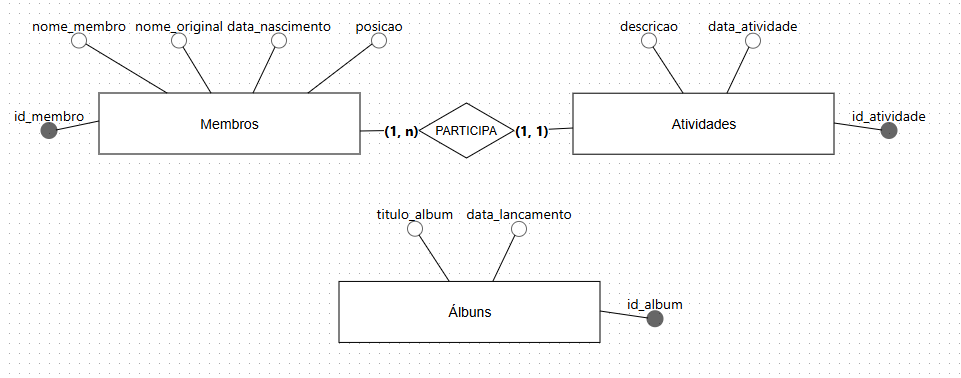
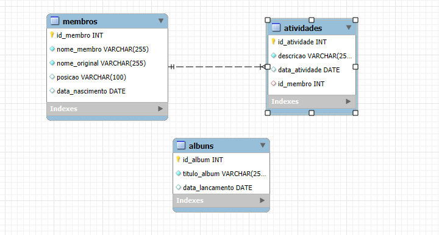

# Projeto de Banco de Dados : Gerenciamento do Grupo RedVelvet ⋆⭒˚.⋆

## Tecnologias usadas:

- BrModelo
- MySQL WorkBench

## Introdução ⋆⭒˚.⋆

Este projeto consiste na modelagem e implementação de um banco de dados relacional para gerenciar informações sobre o grupo de K-pop **Red Velvet**. O objetivo é organizar dados sobre as membros, seus álbuns e suas atividades individuais!

## Descrição do Problema Modelado ⋆⭒˚.⋆

O objetivo desse problema era a criação de uma estrutura de banco de dados que permite armazenar e consultar de forma eficiente informações sobre o grupo.O projeto aborda as seguintes informações:

-   Detalhes das membros, como nome artístico, nome original e a data de nascimento.

-   Lista de álbuns lançados, com seus títulos e datas.

-   Registro das atividades individuais de cada membro, como estreias solo ou em atuação.

## Explicação das Entidades e Relacionamentos ⋆⭒˚.⋆

#### MODELO CONCEITUAL

#### MODELO LÓGICO

---

### Entidades

---

- **Membros:** Responsável por armazenar as informações dos integrantes do grupo.

- **Atributos:** id_membro (chave primária), nome_membro, nome_original, data_nascimento e posicao.
 
---

- **Atividades:** Responsável por registrar as atividades notáveis e eventos de cada membro.

- **Atributos:** id_atividade (chave primária), descricao, data_atividade e id_membro (chave estrangeira).

---

- **Álbuns:** Responsável por catalogar a discografia do grupo.

- **Atributos:** id_album (chave primária), titulo_album e data_lancamento. (Esta tabela é independente das outras, demonstrando que os álbuns são lançamentos do grupo como um todo).

---

### Relacionamentos

- **Membros e Atividades:**

- **Tipo:** Um para Muitos (1:N) e um para um (1:1).

- **Cardinalidade:** Um Membro pode ter uma ou muitas Atividades, mas cada Atividade está associada a exatamente um Membro.

---

## Consultas Realizadas ⋆⭒˚.⋆

#### Consulta 1: 

Esta consulta mostra o nome ártistico, nome original, posição e data de nascimento de todas os membros do grupo.

#### Consulta 2: 

Esta consulta filtra os álbuns por data de lançamento, ordenando-os cronologicamente.

#### Consulta 3: 

Esta consulta utiliza um JOIN para combinar as tabelas Membros e Atividades, permitindo associar a descrição e a data de uma atividade ao nome do membro que a realizou.

